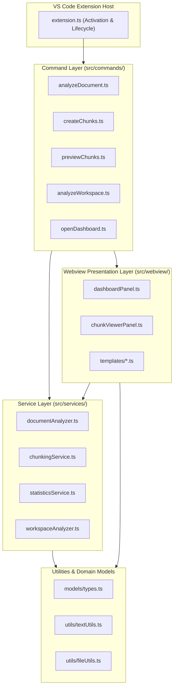
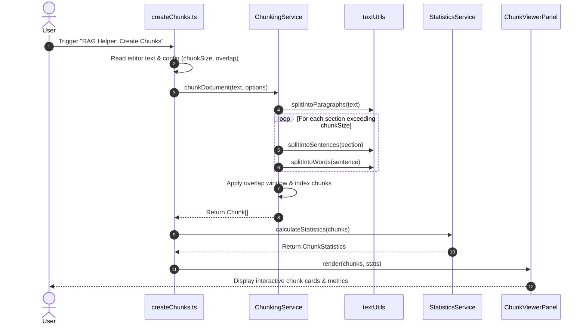

# Architecture

This document describes the architectural design, layer responsibilities, module relationships, and engineering principles of the **RAGLaB** VS Code extension.

---

## 1. System Overview & Layered Architecture

RAGLaB is organized into clean, decoupled layers to ensure strict separation of concerns, high testability, and clear boundaries between VS Code editor APIs, pure domain business logic, and presentation views.



### Architectural Flow

```
VS Code Extension Host
        ↓
  Command Layer (commands/)
        ↓
  Service Layer (services/)
        ↓
  Utility Layer (utils/)
        ↓
  Webview UI (webview/)
```

---

## 2. Layer Responsibilities

### 2.1 Extension Host & Entry Point
- **Directory / File**: `src/extension.ts`
- **Contains**: `activate(context: vscode.ExtensionContext)` and `deactivate()` lifecycle hooks.
- **Responsibilities**:
  - Registers all user commands with the VS Code command registry.
  - Instantiates singleton or shared service dependencies.
  - Subscribes disposables to `context.subscriptions` to prevent memory leaks.
  - Initializes status bar items and sidebar views.
- **Dependencies**: `vscode` API, command handlers.

### 2.2 Command Layer
- **Directory**: `src/commands/`
- **Contains**: VS Code command handler functions.
- **Responsibilities**:
  - Bridges VS Code editor context (active editors, selections, workspace configuration, user input prompts) to the Service Layer.
  - Handles VS Code UI interactions such as `vscode.window.showInputBox`, `vscode.window.showInformationMessage`, and progress notifications.
  - Catches domain errors and translates them into user-friendly UI notifications.
- **Dependencies**: `vscode` API, `src/services/`, `src/webview/`, `src/models/types.ts`.

### 2.3 Service Layer
- **Directory**: `src/services/`
- **Contains**: Pure TypeScript business logic classes and functions.
- **Responsibilities**:
  - Encapsulates domain logic: text segmentation, boundary detection, token calculations, statistical analysis, and workspace scanning.
  - **Zero or Minimal VS Code API coupling**: Designed to execute in standalone Node.js environments (such as unit tests in Mocha/Jest) without requiring a running VS Code Extension Host.
- **Dependencies**: `src/models/types.ts`, `src/utils/`.

### 2.4 Utility Layer & Models
- **Directories**: `src/utils/`, `src/models/`
- **Contains**: Pure helper routines, formatting helpers, and centralized TypeScript type definitions.
- **Responsibilities**:
  - Defines contracts (`DocumentAnalysis`, `Chunk`, `ChunkStatistics`, `WorkspaceAnalysisResult`).
  - Implements generic string utilities, token estimation heuristics, and file system helpers.
- **Dependencies**: Node standard library (`fs`, `path`).

### 2.5 Webview Layer
- **Directory**: `src/webview/`
- **Contains**: Webview panel controllers, message dispatchers, and HTML/CSS/JS template renderers.
- **Responsibilities**:
  - Manages Webview panel lifecycles (creation, retention, disposal).
  - Handles bi-directional asynchronous messaging between the webview script context and the extension host.
  - Employs strict Content Security Policy (CSP) headers and VS Code CSS variables for native look and feel.
- **Dependencies**: `vscode` API, `src/models/types.ts`, HTML templates.

---

## 3. Detailed Module Breakdown

### 3.1 `src/extension.ts`
The root entry point for the extension.
- Coordinates extension activation when triggered by activation events (`onCommand`, workspace detection).
- Configures command bindings:
  ```typescript
  export function activate(context: vscode.ExtensionContext): void {
    // Register commands
    context.subscriptions.push(
      vscode.commands.registerCommand('ragHelper.analyzeDocument', analyzeDocumentCommand),
      vscode.commands.registerCommand('ragHelper.createChunks', createChunksCommand),
      vscode.commands.registerCommand('ragHelper.previewChunks', previewChunksCommand),
      vscode.commands.registerCommand('ragHelper.analyzeWorkspace', analyzeWorkspaceCommand),
      vscode.commands.registerCommand('ragHelper.openDashboard', openDashboardCommand)
    );
  }
  ```

### 3.2 Command Modules (`src/commands/`)

- **`analyzeDocument.ts`**:
  - Inspects `vscode.window.activeTextEditor`.
  - Determines if the active document is within supported formats (`.txt`, `.md`, `.json`, `.csv`) and within size constraints (`ragHelper.maxFileSize`).
  - Delegates to `DocumentAnalyzer` and renders metrics via status bar / notification modal.

- **`createChunks.ts`**:
  - Prompts user for target chunk size and overlap (pre-filling defaults from workspace configuration).
  - Invokes `ChunkingService` to generate chunks.
  - Computes statistics via `StatisticsService` and optionally opens the chunk previewer.

- **`previewChunks.ts`**:
  - Invokes `ChunkViewerPanel.render(context, chunks, stats)` to display the visual chunk inspector.

- **`analyzeWorkspace.ts`**:
  - Queries `vscode.workspace.workspaceFolders`.
  - Passes workspace roots to `WorkspaceAnalyzer`.
  - Displays summary of detected RAG libraries (LangChain, LlamaIndex, vector stores, etc.).

- **`openDashboard.ts`**:
  - Creates or brings to focus `DashboardPanel`.

### 3.3 Service Modules (`src/services/`)

- **`documentAnalyzer.ts` (`DocumentAnalyzer`)**:
  - Analyzes document text to compute:
    - Character count (with and without whitespace)
    - Word count
    - Line count
    - Estimated token count based on subword token heuristics (~4 chars/token for English prose)
    - Lexical density and readability metrics

- **`chunkingService.ts` (`ChunkingService`)**:
  - Implements the recursive hierarchical chunking algorithm:
    1. Paragraph splitting via double newlines (`\n\n`)
    2. Sentence splitting via sentence delimiters (`. `, `! `, `? `, `\n`)
    3. Word splitting via whitespace (` `)
  - Enforces overlap preservation: copies trailing tokens/words from chunk $i$ to prefix chunk $i+1$.
  - Assigns unique metadata to each chunk: `index`, `startChar`, `endChar`, `tokenCount`, `splitReason`.

- **`statisticsService.ts` (`StatisticsService`)**:
  - Aggregates chunk metrics across the document:
    - Min, Max, Mean, Median character length
    - Min, Max, Mean, Median token length
    - Total chunk count
    - Overlap verification (actual overlap characters vs expected)
  - Identifies quality warnings:
    - *Oversized chunks* (unable to split cleanly within bounds)
    - *Undersized / orphaned chunks* (< 10% of target chunk size)
    - *High variance* in chunk lengths

- **`workspaceAnalyzer.ts` (`WorkspaceAnalyzer`)**:
  - Scans project manifests:
    - `package.json` (Node/TypeScript)
    - `requirements.txt`, `Pipfile`, `pyproject.toml` (Python)
  - Detects libraries by signatures:
    - Frameworks: `langchain`, `llama-index`, `haystack`, `semantic-kernel`
    - Vector Databases: `chromadb`, `pinecone`, `weaviate`, `qdrant-client`, `pymilvus`, `pgvector`
    - LLM & Embeddings: `openai`, `anthropic`, `cohere`, `transformers`, `sentence-transformers`

### 3.4 Models (`src/models/types.ts`)

Centralized type contracts:

```typescript
export interface DocumentAnalysis {
  fileName: string;
  filePath: string;
  fileType: SupportedFileType;
  fileSizeBytes: number;
  fileSizeFormatted: string;
  characterCount: number;
  wordCount: number;
  lineCount: number;
  estimatedTokenCount: number;
  averageWordsPerLine: number;
  emptyLineCount: number;
  content: string;
}

export interface ChunkConfig {
  chunkSize: number;
  overlap: number;
}

export interface TextChunk {
  index: number;
  content: string;
  characterCount: number;
  wordCount: number;
  estimatedTokenCount: number;
  startOffset: number;
  endOffset: number;
}

export interface ChunkResult {
  fileName: string;
  config: ChunkConfig;
  chunks: TextChunk[];
  warnings: ChunkWarning[];
}

export interface ChunkWarning {
  severity: WarningSeverity;
  message: string;
  chunkIndex?: number;
}

export interface ChunkStatistics {
  totalChunks: number;
  averageCharacters: number;
  minCharacters: number;
  maxCharacters: number;
  averageEstimatedTokens: number;
  minEstimatedTokens: number;
  maxEstimatedTokens: number;
  averageWords: number;
  minWords: number;
  maxWords: number;
}

export interface DetectedTechnology {
  name: string;
  detected: boolean;
  source?: string;
  category: TechnologyCategory;
}

export interface WorkspaceAnalysis {
  projectName: string;
  rootPath: string;
  technologies: DetectedTechnology[];
  ragDirectories: DetectedDirectory[];
  isLikelyRagProject: boolean;
}

export interface ExtensionConfig {
  defaultChunkSize: number;
  defaultChunkOverlap: number;
  showNotifications: boolean;
  maxFileSize: number;
}
```

### 3.5 Utilities (`src/utils/`)

- **`textUtils.ts`**: Fast, regex-optimized text routines:
  - `estimateTokenCount(text: string): number`
  - `countWords(text: string): number`
  - `splitIntoSentences(text: string): string[]`
  - `truncateText(text: string, maxLength: number): string`
- **`fileUtils.ts`**:
  - Safe file size validation
  - Extension matching and MIME validation
  - Workspace configuration getter/setter helpers

### 3.6 Webview Panels & Templates (`src/webview/`)

- **`dashboardPanel.ts`**:
  - Implements `vscode.WebviewPanel` lifecycle.
  - Hosts the high-level dashboard displaying workspace RAG stack components, quick actions, and extension settings.
- **`chunkViewerPanel.ts`**:
  - Interactive chunk viewer.
  - Supports chunk pagination, search filtering, copy-to-clipboard, and token breakdown.
- **`templates/`**:
  - Functional HTML builders creating secure, accessible UI markup using native VS Code CSS tokens (`var(--vscode-editor-background)`, `var(--vscode-foreground)`, etc.).

---

## 4. Key Design Principles

### 4.1 Independent Service Testability
All core domain logic in `src/services/` and `src/utils/` is strictly isolated from the `vscode` runtime package. This enables unit tests to execute rapidly in standard Node.js test runners without requiring the heavy `@vscode/test-electron` test host.

### 4.2 Native VS Code Look and Feel
Webview interfaces do not inject external styling libraries or rigid color schemes. Instead, they consume standard VS Code CSS Custom Properties:
- Background: `var(--vscode-editor-background)`
- Foreground: `var(--vscode-editor-foreground)`
- Borders: `var(--vscode-widget-border)`
- Buttons: `var(--vscode-button-background)`, `var(--vscode-button-foreground)`
This ensures 100% aesthetic compatibility across all VS Code themes (Dark+, Light+, Solarized, High Contrast, etc.).

### 4.3 100% Local & Zero Telemetry
The extension operates completely offline. No document snippets, statistics, file paths, or system identifiers leave the user's workstation.

### 4.4 Non-Destructive File Operations
All file system operations are strictly read-only by default. Creating chunks analyzes and presents chunks in memory or within webview inspectors without altering the source document on disk.

### 4.5 Robust Error Handling & Graceful Degradation
- Exceeding file limits (`ragHelper.maxFileSize`) results in an informational warning rather than UI freeze or process crash.
- Unsupported file formats prompt the user with clear remediation steps.
- Malformed inputs fallback safely to word-level chunking.

---

## 5. Chunking Algorithm Data Flow



---

## 6. Security Architecture & CSP

Webviews are protected against Cross-Site Scripting (XSS) and code injection by enforcing a strict **Content Security Policy (CSP)**:

```html
<meta http-equiv="Content-Security-Policy" 
      content="default-src 'none'; 
               img-src ${webview.cspSource} https:; 
               script-src 'nonce-${nonce}'; 
               style-src ${webview.cspSource} 'unsafe-inline';" />
```

- Dynamic nonces are generated per render session.
- Inline script execution is blocked unless authorized by the session nonce.
- Outbound network calls from webviews (`connect-src`) are disabled.
- All user text rendered in the webview is HTML-entity escaped before insertion into the DOM.
