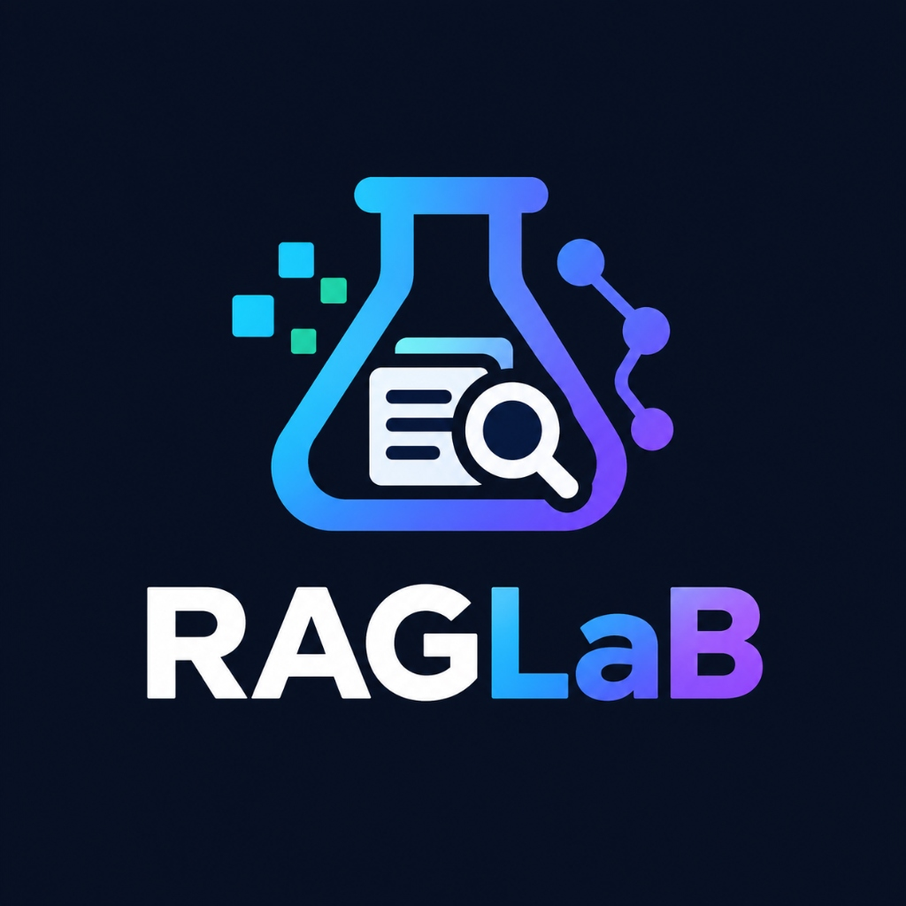

  

# RAGLaB User Guidelines and Engineering Handbook

Welcome to **RAGLaB** — the interactive GUI studio designed for engineers, researchers, and developers constructing and tuning **Retrieval-Augmented Generation (RAG)** systems.

This handbook details how to operate every capability of RAGLaB directly through the **Graphical User Interface (GUI)** without requiring command-line commands, external backend daemons, or cloud API keys.

---

## Table of Contents

1. [Quick Start: Opening the Workbench](#1-quick-start-opening-the-workbench)
2. [Document Inspector Guide](#2-document-inspector-guide)
3. [Chunking Studio and Visualizer Guide](#3-chunking-studio-and-visualizer-guide)
4. [Local Retrieval Simulator and Headroom Guide](#4-local-retrieval-simulator-and-headroom-guide)
5. [Workspace Technology Scanner Guide](#5-workspace-technology-scanner-guide)
6. [Sidebar Controller](#6-sidebar-controller)
7. [Chunking Engineering Principles](#7-chunking-engineering-principles)
8. [Diagnostic Warnings and Troubleshooting](#8-diagnostic-warnings-and-troubleshooting)

---

## 1. Quick Start: Opening the Workbench

RAGLaB Studio can be accessed through three entry points:

### Option A: From the Activity Bar
1. Click the beaker icon on the left VS Code Activity Bar labeled **RAGLaB**.
2. Click **Launch Visual Workbench**.

### Option B: From the Command Palette
1. Press `Ctrl+Shift+P` (or `Cmd+Shift+P` on macOS).
2. Type `RAGLaB` and choose **RAGLaB: Open Studio Dashboard**.

### Option C: Right-Click in the Editor or Explorer
1. Right-click any `.md`, `.txt`, `.json`, or `.csv` file.
2. Select **RAGLaB: Analyze Document** or **RAGLaB: Create Chunks**.

---

## 2. Document Inspector Guide

The **Document Inspector** parses raw documents to calculate character count, word density, line distribution, and estimated token usage.

### How to Use the Interface:
1. Open the **Document Inspector** tab inside RAGLaB Studio.
2. Load content using any of the four input methods:
   - **Select File from Disk**: Select any supported text file (`.txt`, `.md`, `.json`, `.csv`) from your filesystem.
   - **Load Active File**: Imports text directly from whichever tab is currently open in your editor.
   - **Load Sample Document**: Instantly loads a comprehensive technical guide on RAG concepts for rapid experimentation without local files.
   - **Scratchpad**: Type or paste arbitrary text into the textarea and click **Analyze Text**.
3. Review key document metrics:
   - **Characters**: Total raw characters in the source.
   - **Words**: Word count based on whitespace separation.
   - **Estimated Tokens**: BPE token heuristic (`~words x 1.3`).
   - **Lines and Blank Lines**: Total line count alongside empty line distribution.
   - **Average Words per Line**: Text density metric.
4. If excessive empty lines or unusual formatting are detected, a warning banner will appear.
5. Click **Send to Chunking Studio** to pass the active content straight into the chunking workbench.

---

## 3. Chunking Studio and Visualizer Guide

The **Chunking Studio** divides source text into semantically cohesive partitions using your choice of three architectural strategies:

### Architecture Strategies in the GUI:
1. **Parent-Document (Small-to-Big) [Highest Accuracy]**:
   - Generates compact Child Search Units (250–300 chars) for high-precision vector similarity matching.
   - Generates large Parent Context Units (1,200–1,500 chars) that are fed into the LLM prompt.
   - Completely eliminates vector dilution while ensuring the model has full surrounding context.
2. **Markdown & Structural Hierarchy [AST Integrity]**:
   - Treats Markdown tables and fenced code blocks as unbroken atomic units (never sliced across borders).
   - Generates hierarchical breadcrumbs (`[Document > Section > Subsection]`) so isolated chunks retain their structural context.
3. **Recursive Boundary-Aware [Balanced]**:
   - Splits text sequentially along paragraph (`\n\n`), sentence (`. ! ?`), and word boundaries.

### Configuring Parameters:
1. Open the **Chunking Studio** tab.
2. Select your **Architecture Strategy** from the dropdown.
3. Adjust settings with the sliders, steppers, or one-click **Quick Presets**:
   - **Factoid (250 / 25)**: Compact segments for strict fact extraction and FAQ lookup.
   - **Standard RAG (500 / 50)**: Balanced segments for general technical documentation.
   - **Deep Context (1000 / 100)**: Broad segments for narrative prose and summaries.
   - When in Parent-Document mode, customize **Parent Context Size** (default: 1,200 chars).
4. **Live Validation**: The interface validates your parameters in real time. Alerts will flag if overlap equals or exceeds chunk size, or if parent size is smaller than child size.
5. Click **Generate Chunks**.

### Navigating and Inspecting Chunks:
- **Parent-Document Dual View**:
  - In Parent-Document mode, click **Child Search Unit** to inspect the exact vector search unit, or click **Parent LLM Context** to inspect the full context block with the child unit highlighted inside it.
- **Hierarchy & Structural Badges**:
  - Review the active heading breadcrumb trail (e.g. `System > Database > PostgreSQL Config`) and atomic block badges (`Preserved Table`, `Preserved Code Block`).
- **Navigation Controls**:
  - Click **Previous** and **Next** or use the left and right keyboard arrow keys to step through segments.
  - Enter a number into the `Chunk [ X ] of [ Total ]` field to jump directly to any chunk.
- **Search and In-Place Highlighting**:
  - Type terms into the search bar.
  - Matches are highlighted in yellow inside the chunk text in real time.
  - The match counter reports how many chunks contain the query.
- **Metrics**:
  - Every chunk displays its exact character count, word count, estimated token footprint, and source character offsets.
  - The **Chunk Utilization Progress Bar** visualizes length relative to the target size.
- **Exporting**:
  - Click **Copy Chunk** to copy the displayed segment to the clipboard.
  - Click **Copy All Chunks** to copy all segments with demarcated headers.
  - Click **Copy JSON** to copy the full structured dataset.
  - Click **Save to File (.json)** to save the dataset directly to a `.json` file in your workspace.

---

## 4. Local Retrieval Simulator and Headroom Guide

Located directly beneath the chunk viewer in the Chunking Studio, the **Retrieval Simulator** lets you test retrieval viability before publishing to a vector database.

### How to Use the Simulator:
1. Enter a realistic user prompt or question (for example: *"Why is sentence boundary preservation critical for vector search?"*).
2. Click **Retrieve Top Chunks** or press `Enter`.
3. The internal TF-IDF scoring engine evaluates all chunks and displays the **Top-3 Ranked Matches** with relevance score percentages.
4. When Parent-Document mode is active, each card displays the matching child score alongside the **Parent Context token size**.
5. **Click any ranked card** to jump directly to that chunk in the explorer with query terms highlighted.
6. **LLM Context Headroom Gauge**:
   - Displays the cumulative token count of the retrieved chunks (or unique parent context blocks).
   - Calculates the percentage footprint against standard 4K and 8K context windows so you can ensure your prompt templates and system instructions have sufficient space.

---

## 5. Workspace Technology Scanner Guide

The **Workspace Scanner** audits your repository to discover RAG libraries, vector databases, embedding frameworks, and ingestion directories.

### How to Run the Scanner:
1. Open the **Workspace Scanner** tab.
2. Click **Scan Workspace**.
3. Review your RAG architecture summary:
   - **Readiness Pill**: Indicates `[Active]` when vector stores, embedding models, or orchestrators are found, or `[Standard Project]` when none are detected.
   - **Category Filters**: Filter cards by `All`, `Vector DBs`, `Embeddings`, `Orchestration`, or `Frameworks`.
   - **Technology Cards**: Displays each technology with its status (`[Active]` with source file vs `[Not Found]`).
   - Supported frameworks include: `pgvector`, `Chroma`, `FAISS`, `Qdrant`, `Pinecone`, `Weaviate`, `Milvus`, `PostgreSQL`, `Sentence Transformers`, `OpenAI`, `HuggingFace`, `LangChain`, `LlamaIndex`, `Haystack`, `FastAPI`, `Flask`, `Express`, `Python`, and `TypeScript`.
   - **RAG Directories**: Lists folders configured for data ingestion, such as `documents/`, `embeddings/`, and `retrieval/`.
   - **Copy Report**: Copies the full text diagnostic audit to your clipboard.

---

## 6. Sidebar Controller

The RAGLaB Sidebar provides quick-access controls in VS Code's Activity Bar:
- **Launch Visual Workbench**: Opens the primary multi-tab studio.
- **Analyze Document Structure**: Prompts for a file and shows its profile in the inspector.
- **Partition & Chunk Document**: Opens chunking options for the active or selected file.
- **Preview Active Document**: Generates an immediate chunk preview of the current editor file.
- **Scan RAG Tech Stack**: Triggers a repository audit.

---

## 7. Chunking Engineering Principles

### Chunk Size Strategy
Chunk size dictates the balance between contextual breadth and vector specificity:

| Chunk Size | Approximate Tokens | Ideal Use Case | Trade-offs |
|---|---|---|---|
| **Small (100-300 chars)** | 25-75 tokens | Fact extraction, FAQ lookups, strict sentence matching | High precision, low noise; lacks surrounding narrative context. |
| **Medium (500-1,000 chars)** | 125-250 tokens | Technical manuals, articles, general Q&A | Balanced context and vector specificity (standard default). |
| **Large (1,200-2,500 chars)** | 300-600 tokens | Summarization, contracts, comprehensive analysis | Broad context; potential dilution of vector similarity scores. |

### Overlap Principles
- Always maintain an overlap between **10% and 20%** (for example, 50 characters for a 500-character chunk).
- Overlap prevents context loss: without overlap, keywords or phrases split across boundary cuts lose semantic continuity in vector space.

---

## 8. Diagnostic Warnings and Troubleshooting

| Warning in GUI | Cause | Recommended Action |
|---|---|---|
| `[Notice] Very small chunk detected` | A chunk has fewer than 50 characters, often due to a short trailing paragraph. | Review your document endings or adjust minimum chunk thresholds. |
| `[Warning] Large chunk detected` | A paragraph or sentence exceeded 1.5x the target chunk size without natural breaks. | Add punctuation or line breaks to long run-on sentences. |
| `[Warning] High ratio of empty lines` | More than 30% of document lines are blank. | Clean and normalize document whitespace before embedding. |
| `[Error] Overlap must be strictly less than chunk size` | Overlap was set greater than or equal to chunk size. | Decrease overlap or increase chunk size using the sliders. |
| `[Error] Document contains no usable text` | File is empty or contains only whitespace. | Verify source file contents before processing. |

---

*RAGLaB is developed and executed entirely on your local machine with zero external network calls.*
